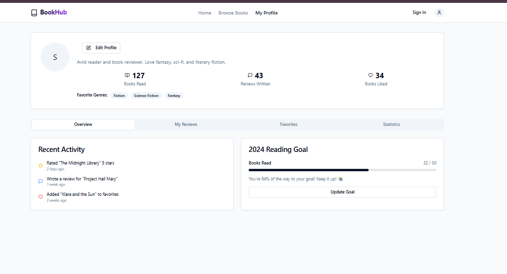

# 📚 BookHub – Read It. Review It.

**BookHub** is a clean, modern, and responsive Book Review Web App built using **React**, **TypeScript**, **Vite**, and **Tailwind CSS**.  
It allows users to explore book listings, read community reviews, and submit their own thoughts in an elegant interface.

---

## 🔍 Overview

This project was built from scratch by **Shalika Ritu** as part of a learning journey in web development and full-stack engineering.  
It showcases modular component design, page-based routing, and scalable UI architecture.

---

## 🚀 Features

- 📖 Browse a list of books
- 📝 Submit and view book reviews
- 🔍 Clean and accessible UI
- 🎨 Styled with Tailwind CSS
- ⚛️ Built with React + TypeScript
- 🌐 Supports multiple routes (e.g., `/books`, `/about`)
- 💡 Easy to extend with backend or authentication

---

## 🛠 Tech Stack

| Category     | Technology                  |
|--------------|-----------------------------|
| Framework    | React                       |
| Language     | TypeScript                  |
| Styling      | Tailwind CSS                |
| Tooling      | Vite                        |
| Deployment   | Vercel (for frontend)       |

---

## 📂 Project Structure
Visit http://localhost:8080 in your browser.

## Screenshot

🏠 Home Page

📝 Review Page

👤 Profile Page

## Planned Improvements
🔐 Firebase Authentication

🌙 Dark Mode Toggle

⭐ Star-based Rating System

💬 Comment threads under each review

📊 Analytics for most reviewed books

## Author
Shalika Ritu
B.Tech CSE & AI
Passionate about building meaningful digital experiences through code.
📫 LinkedIn/shalika-ritu | GitHub/shalikaritu

📄 License
This project is licensed under the MIT License.